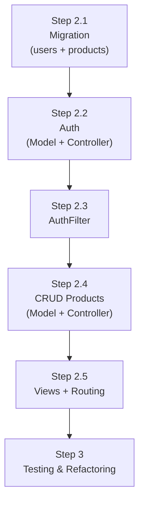

# Issue #1 — High-Level Planning: CI4 CRUD + Login System

> **Status:** 🟡 In Progress  
> **Dibuat:** 2026-09-28  
> **Referensi:** [`prompts.md`](./prompts.md)  
> **Environment:** CodeIgniter 4.7.4 · PHP 8.2 · MySQL (MySQLi) · XAMPP

---

## Tujuan Dokumen

Dokumen ini adalah **panduan eksekusi utama** untuk AI Agent dalam membangun sistem CI4 dengan fitur:
- Autentikasi (Register, Login, Logout) berbasis Session + Password Hashing
- CRUD Products yang diproteksi oleh `AuthFilter`
- Migrasi database terstruktur menggunakan CI4 Migration

Dokumen ini **tidak memuat kode program lengkap** — kode akan ditulis saat eksekusi tiap step.

---

## Struktur Folder yang Digunakan

```
app/
├── Config/
│   ├── Routes.php           ← Registrasi semua route (auth & products)
│   └── Filters.php          ← Registrasi alias filter 'auth'
│
├── Controllers/
│   ├── AuthController.php   ← Menangani Register, Login, Logout
│   └── ProductController.php← Menangani CRUD Products
│
├── Filters/
│   └── AuthFilter.php       ← Redirect ke login jika user belum login
│
├── Models/
│   ├── UserModel.php        ← Model tabel `users`
│   └── ProductModel.php     ← Model tabel `products`
│
├── Views/
│   ├── layouts/
│   │   └── main.php         ← Layout utama (navbar, wrapper)
│   ├── auth/
│   │   ├── register.php     ← Form Register
│   │   └── login.php        ← Form Login
│   └── products/
│       ├── index.php        ← Daftar semua produk
│       ├── create.php       ← Form tambah produk
│       └── edit.php         ← Form edit produk
│
└── Database/
    └── Migrations/
        ├── 2026-09-28-000001_CreateUsersTable.php
        └── 2026-09-28-000002_CreateProductsTable.php
```

---

## Skema Database MySQL

### Tabel `users`

| Kolom        | Tipe           | Keterangan                        |
|--------------|----------------|-----------------------------------|
| `id`         | INT UNSIGNED   | Primary Key, Auto Increment       |
| `name`       | VARCHAR(100)   | Nama lengkap user                 |
| `email`      | VARCHAR(150)   | Unik, digunakan sebagai username  |
| `password`   | VARCHAR(255)   | Hash bcrypt via `password_hash()` |
| `created_at` | DATETIME       | Otomatis diisi CI4                |
| `updated_at` | DATETIME       | Otomatis diisi CI4                |

### Tabel `products`

| Kolom        | Tipe           | Keterangan                        |
|--------------|----------------|-----------------------------------|
| `id`         | INT UNSIGNED   | Primary Key, Auto Increment       |
| `name`       | VARCHAR(150)   | Nama produk                       |
| `description`| TEXT           | Deskripsi produk (nullable)       |
| `price`      | DECIMAL(15,2)  | Harga produk                      |
| `stock`      | INT UNSIGNED   | Jumlah stok                       |
| `created_at` | DATETIME       | Otomatis diisi CI4                |
| `updated_at` | DATETIME       | Otomatis diisi CI4                |

---

## Roadmap Eksekusi: Step 2.1 — 2.5

---

### ✅ Step 2.1 — Database Migration

**Tujuan:** Membuat struktur tabel `users` dan `products` menggunakan CI4 Migration agar skema database terdokumentasi dan dapat direproduksi.

**Tugas:**
1. Buat migration file untuk tabel `users` via `php spark make:migration CreateUsersTable`
2. Buat migration file untuk tabel `products` via `php spark make:migration CreateProductsTable`
3. Definisikan kolom sesuai skema di atas menggunakan `$this->forge` (CI4 DBForge)
4. Jalankan migrasi: `php spark migrate`
5. Verifikasi tabel terbentuk di database `ci4_crud_db`

**Output yang diharapkan:** Dua tabel `users` dan `products` muncul di MySQL.

---

### ✅ Step 2.2 — Auth System: Model & Controller

**Tujuan:** Membangun sistem autentikasi (Register, Login, Logout) menggunakan CI4 Session dan password hashing native PHP.

**Tugas:**

**Model (`UserModel.php`):**
- Definisikan `$table`, `$allowedFields`, `$useTimestamps = true`
- Aktifkan `$validationRules` untuk field `email` (unik) dan `password`
- Buat method helper untuk mencari user by email

**Controller (`AuthController.php`):**
- Method `register()` — tampilkan form + proses POST:
  - Validasi input (nama, email unik, password min 8 karakter)
  - Hash password dengan `password_hash($password, PASSWORD_BCRYPT)`
  - Simpan ke `UserModel`, redirect ke login
- Method `login()` — tampilkan form + proses POST:
  - Cari user by email
  - Verifikasi password dengan `password_verify()`
  - Set session data (`user_id`, `user_name`, `is_logged_in = true`)
  - Redirect ke halaman products
- Method `logout()`:
  - Hapus/destroy session
  - Redirect ke login

**Output yang diharapkan:** User dapat register, login, dan logout dengan aman.

---

### ✅ Step 2.3 — AuthFilter

**Tujuan:** Melindungi route `/products/*` agar hanya bisa diakses oleh user yang sudah login.

**Tugas:**

**Filter (`AuthFilter.php`):**
- Implementasikan interface `FilterInterface`
- Di method `before()`: cek apakah `session()->get('is_logged_in')` bernilai `true`
- Jika tidak login → redirect ke `/login` dengan flash message "Silakan login terlebih dahulu"
- Method `after()` dibiarkan kosong

**Registrasi Filter (`app/Config/Filters.php`):**
- Tambahkan alias `'auth'` yang menunjuk ke `\App\Filters\AuthFilter::class`

**Registrasi di Routes (`app/Config/Routes.php`):**
- Terapkan filter `auth` pada grup route `/products`

**Output yang diharapkan:** Akses langsung ke `/products` tanpa login akan di-redirect ke `/login`.

---

### ✅ Step 2.4 — CRUD Products: Model & Controller

**Tujuan:** Membangun operasi Create, Read, Update, Delete untuk tabel `products`.

**Tugas:**

**Model (`ProductModel.php`):**
- Definisikan `$table = 'products'`, `$allowedFields`, `$useTimestamps = true`
- Aktifkan `$validationRules` untuk field `name` (required), `price` (numeric, > 0), `stock` (integer, >= 0)

**Controller (`ProductController.php`):**
- Method `index()` — ambil semua data dari `ProductModel`, kirim ke view `products/index`
- Method `create()` — tampilkan form kosong
- Method `store()` — proses POST:
  - Validasi input
  - Simpan ke `ProductModel`
  - Redirect ke index dengan flash message sukses
- Method `edit($id)` — ambil data produk by ID, tampilkan form terisi
- Method `update($id)` — proses POST update:
  - Validasi input
  - Update record di `ProductModel`
  - Redirect ke index
- Method `delete($id)` — hapus record by ID, redirect ke index

**Output yang diharapkan:** Semua operasi CRUD berjalan dengan validasi dan feedback ke user.

---

### ✅ Step 2.5 — Views & Routing

**Tujuan:** Membuat tampilan UI sederhana dan menyambungkan semua route.

**Tugas:**

**Views:**
- `layouts/main.php` — layout dasar dengan navbar (tampilkan nama user + tombol Logout jika login)
- `auth/register.php` — form: Nama, Email, Password, Konfirmasi Password
- `auth/login.php` — form: Email, Password; tampilkan flash message jika ada error
- `products/index.php` — tabel daftar produk + tombol Tambah, Edit, Hapus; flash message sukses/error
- `products/create.php` — form tambah produk (Name, Description, Price, Stock)
- `products/edit.php` — form edit produk (pre-filled data)

**Validasi UI:**
- Tampilkan pesan error validasi inline di bawah tiap field
- Gunakan CI4 `session()->getFlashdata()` untuk notifikasi sukses/gagal

**Routing (`app/Config/Routes.php`):**

```
// Auth Routes (tanpa filter)
GET  /register        → AuthController::register
POST /register        → AuthController::register
GET  /login           → AuthController::login
POST /login           → AuthController::login
GET  /logout          → AuthController::logout

// Product Routes (dengan filter 'auth')
GET  /products        → ProductController::index
GET  /products/create → ProductController::create
POST /products/store  → ProductController::store
GET  /products/edit/$id   → ProductController::edit
POST /products/update/$id → ProductController::update
GET  /products/delete/$id → ProductController::delete
```

**Output yang diharapkan:** Seluruh UI dapat diakses, navigasi berjalan, dan proteksi route aktif.

---

## Urutan Eksekusi yang Disarankan



---

## Catatan Teknis untuk AI Agent

> [!IMPORTANT]
> - Gunakan **CI4 Migration** (bukan raw SQL) untuk semua perubahan skema database.
> - Semua password **wajib** di-hash dengan `PASSWORD_BCRYPT` sebelum disimpan. Jangan pernah simpan plain text.
> - `AuthFilter` harus didaftarkan di `app/Config/Filters.php` sebelum digunakan di Routes.
> - Gunakan **Flash Session** (`session()->setFlashdata()`) untuk semua feedback ke user (sukses, error, warning).
> - Validasi input dilakukan di **Controller menggunakan `$this->validate()`**, bukan di Model saja.
> - Seluruh route product menggunakan **method chaining filter** di `Routes.php` (`->filter('auth')`).

> [!WARNING]
> - Jangan mengubah file di dalam folder `vendor/` — semua kustomisasi dilakukan di folder `app/`.
> - Field `password` di `$allowedFields` pada `UserModel` **harus disertakan** agar bisa disimpan.
> - Pastikan ekstensi PHP `mysqli` aktif di `php.ini` (sudah default di XAMPP).

---

*Dokumen ini akan diupdate secara otomatis saat tiap step selesai dieksekusi.*
